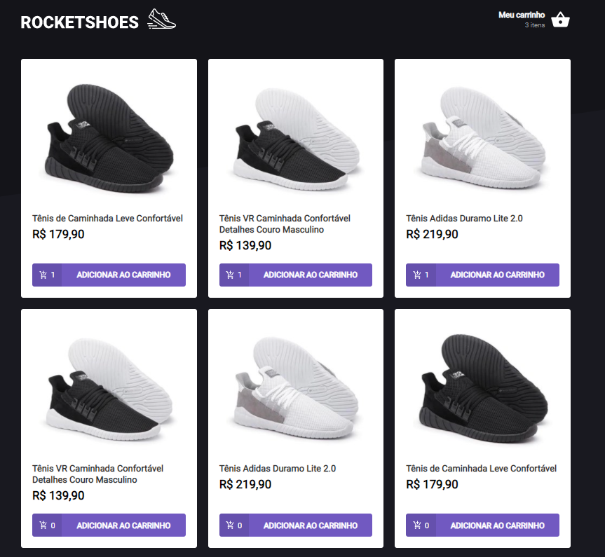
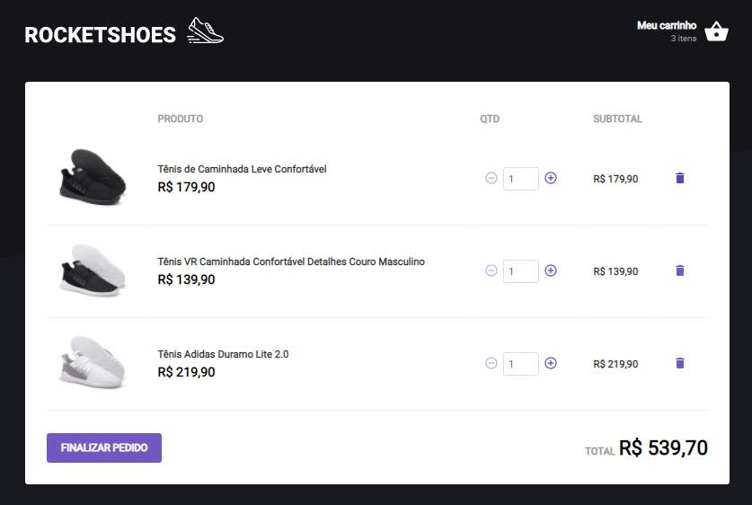

  <h1>:rocket: Rocket-Shoes  </h1>
  <h2>2nd Challenge Ignite React Track</h2>
  
Second challenge proposed in the React track of Rocketseat's Ignite. In this challenge, we were asked to apply what we learned in the second module regarding FakeAPI, the use of Contexts, and the creation of functionalities in a new hook (useCart) created for the project.

  
It was not possible to deploy this project due to the need to use the FakeAPI with JSON Server.

## Proposed Activities
- [x] Add a new product to the cart
- [x] Remove a product from the cart
- [x] Change the quantity of a product in the cart
- [x] Calculation of subtotal and total prices of the cart
- [x] Stock validation
- [x] Display error messages

## Extras
- [x] Fake API with JSON Server
- [x] Preserve cart data with localStorage API
- [x] Show errors with toastify

<h3>Main Screen</h3>

On the main screen, you can see the quantity of items present in the cart, being able to add them by clicking "Add to cart", and also being able to see the quantity of a specific item in the cart. All product data was consumed from a FakeAPI. Validation is done on both screens to check if the product is in stock.

<h3>Shopping Cart</h3>

On this screen, you can see the products added to the cart, being able to remove them or increase or decrease the respective quantity of each product. By clicking on one of the buttons, the subtotal and total are automatically adjusted. All products added to the cart are kept even if you close the browser, due to the use of LocalStorage.

## Giving feedback

Feedback is always welcome. If you have any suggestions or questions, please feel free to send me an email: gcgonzalez99@hotmail.com
